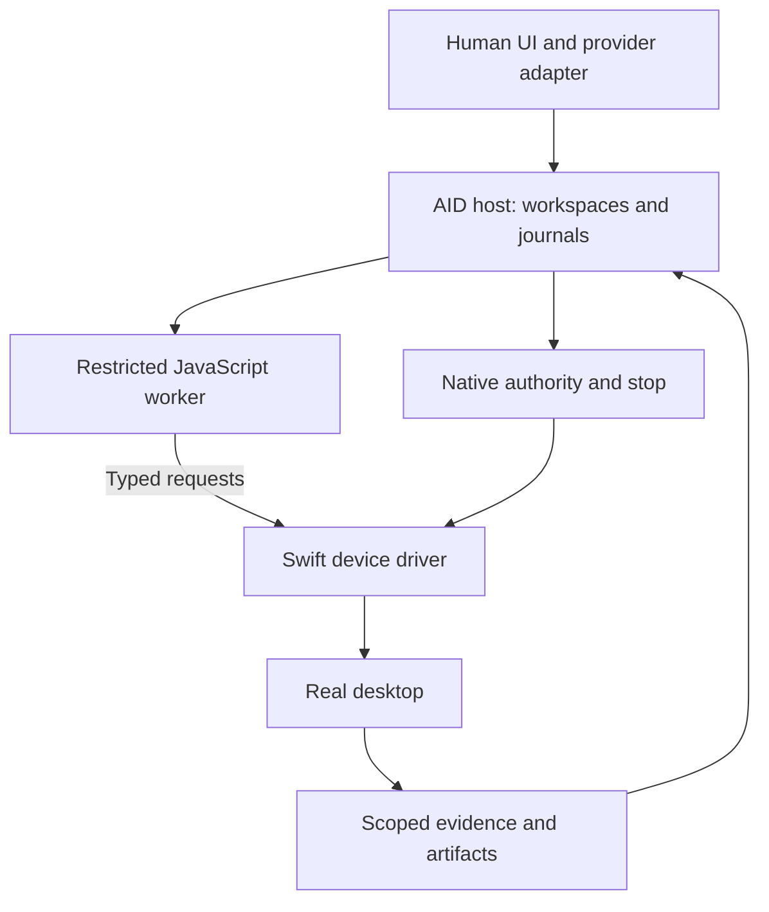

# Cozea AID Environment — master system design

**Design revision:** 1.1, reconciled 2026-09-09. **Status:** implementation specification; native delivery, isolation, and provider compatibility still require the named qualification gates. **Repository:** `Cozea/electron-app`. **Branch:** `feat/programmable-aids-runtime`.

Read [the implementation handoff](HANDOFF.md) for reading order and repeatable checks, and [the completion review](DESIGN-REVIEW.md) for resolved contradictions and scenario traces.

## 0. Authority, evidence, and implementation rule

This is the entry point for implementing programmable **Agent Interface Devices (AIDs)** in Cozea. It expands the [reference architecture](https://github.com/Cozea/electron-app/blob/b8852de1b7372269f2dd2ee0308be564c7fc00a6/docs/computer-use-aid-environment-design.md), [product definition](https://github.com/Cozea/electron-app/blob/b8852de1b7372269f2dd2ee0308be564c7fc00a6/docs/computer-use-programmable-aids.md), and [platform opportunities](https://github.com/Cozea/electron-app/blob/b8852de1b7372269f2dd2ee0308be564c7fc00a6/docs/computer-use-current-platform-opportunities-2026-09.md). Those remain historical rationale. This master, its subsystem specifications, and the [contract artifacts](contracts/README.md) control new implementation work. [Computer Use v2](https://github.com/Cozea/electron-app/blob/b8852de1b7372269f2dd2ee0308be564c7fc00a6/docs/computer-use-v2.md) describes the baseline, not restrictions that must survive.

The code baseline reviewed is `8e65b729e47c0c1bdfdd8555f55f0338cc95223f`; the design branch before this set is `b8852de1b7372269f2dd2ee0308be564c7fc00a6`. The vendored T3 gitlink is `be4668f7b439499f39a659055d0f6ec34ac666b2`. Do not treat the raw T3 tool table as the effective v2 catalogue: Cozea currently patches it from its canonical resource. [D01](01-baseline-decisions.md) records this boundary.

Statements in these documents have four meanings: **baseline fact**, **reported observation**, **design requirement**, or **qualification target**. Platform facts refer to the [research register](29-research-register.md). All resource and latency numbers are proposed defaults/targets, not measurements. A qualification gate is a prescribed experiment with a defined response to failure, not permission to improvise silently.

**Implementation rule:** implement the specified contracts and tests in [D28](28-implementation-roadmap.md). Change a design decision only by adding an ADR explaining contradictory evidence, updating dependent schemas/examples/tests, and recording the change in continuity. Do not replace a missing capability with terminal execution, remove a difficult test, or describe a compiled prototype as a qualified computer controller.

## 1. System objective

An agent should be able to express an arbitrary relevant computer procedure, retain useful program state, observe the evidence necessary for judgment, and execute predictable work locally. The human watches the real application and can stop it. The native implementation should not force one inference round trip per click or one screenshot per stroke.

This is a programmable device environment, not a collection of task macros. The model chooses what to do; JavaScript supplies control flow and computation; the native motor kernel supplies reliable input scheduling; the evidence service reports what actually happened. Neither the SDK nor a background helper secretly interprets “draw a dog.”

The objective is **verified task completion with minimal avoidable infrastructure overhead**. It is not maximum event rate. OS protection, application behavior, display scheduling, network loading, and human approvals remain real constraints. Their costs must be measured separately rather than attributed to model intelligence or hidden by large app waits.

## 2. Fixed product invariants

| ID | Requirement |
| --- | --- |
| INV-01 | Visible computer mode operates through actual UI. No terminal/API completion disguised by a cursor animation. |
| INV-02 | The actual visible pointer hotspot reaches a discrete target before contact; held gestures follow their programmed path. |
| INV-03 | JavaScript supports ordinary computation, functions, closures, modules, loops, conditions, exceptions, and asynchronous composition. |
| INV-04 | One physical-input writer per login seat, including focus, keyboard/modifiers, pointer/buttons and scroll gesture state. |
| INV-05 | Generated code has no ambient Electron, Node, filesystem, process, network, TCC or raw-native authority. |
| INV-06 | Every effect is authorized and target-validated at the native boundary; handles and trace IDs are not credentials. |
| INV-07 | No automatic replay after a potentially submitted non-idempotent effect. |
| INV-08 | Capture is owned by an active control scope, not by the time since a screenshot request. Images are transmitted explicitly. |
| INV-09 | Target validity depends on relevant identity/meaning/geometry/focus, not unrelated UI activity. |
| INV-10 | User takeover and revocation stop admission independently of the model and guest event loop. |
| INV-11 | Submission, observation evidence and verified outcome remain distinct. |
| INV-12 | Pure workspace memory can outlive a control episode; live input/capture authority cannot silently do so. |
| INV-13 | Raw supported primitives and raw evidence remain reachable beneath convenience abstractions. |
| INV-14 | Unknown platform capability is reported as unsupported or unqualified, never simulated and advertised as real support. |

These invariants supersede v2's blanket observation-coherence veto, request-idle capture expiry, PID-only drag/keyboard, and fixed cursor travel assumption. They do not supersede device authentication, scheduled-task denial, or user permission boundaries.

## 3. Architecture and rates

There are three rates. The **model** operates at judgment speed. The **program** operates at event/condition speed. The **motor kernel** operates at input/presentation speed. Pixel capture can be continuous locally without continuously invoking a model. No high-frequency pointer sample traverses MCP, inference, or a JavaScript callback during a native path.

Selected topology is a separately restricted JS worker and a separately supervised native driver. The current Swift code is reused through extracted or revised components, not copied into a second implementation. A bundled driver `.app` must be qualified for real GUI presentation and TCC attribution. A sandboxed XPC worker is the target OS boundary for the guest engine. [D04](04-isolation-processes.md) defines the exact launch/IPC experiment and fallback policy; there is no permission to ship an unsandboxed worker when that experiment fails.

## 4. Identity and ownership

The host binds all objects to Cozea's existing **device principal** (`identityKey`, the `czd_…` public identity), project/workspace, assistant thread and provider instance. There is no new human-account identity layer. Public IDs locate records; authenticated host context authorizes them.

| Object | Purpose | Persistence |
| --- | --- | --- |
| `workspaceId` | JS realm, named module revisions, pure data | Resident until explicit close/expiry; optional pure-data save |
| `controlId` + epoch | Allowed target/capability scope, capture ownership | Active logical UI-control episode only |
| `executionId` | One cell/program invocation and checkpoint state | Live execution plus admission index retained until namespace closure |
| `operationId` | One admitted native operation/timeline | Journaled; never reused with different content |
| `seatId` | One foreground-input domain | Driver boot/login generation |
| `observationId` | Immutable evidence and timing/coordinates | Explicit bounded retention |
| `elementId` / `surfaceId` | Revalidatable target contract | Owner/runtime generation-bound |
| `checkpointId` | Single-use suspended decision | Live execution and dependency fingerprint |

An HTTP connection, MCP task, provider turn, workspace, and control are not interchangeable. [D05](05-lifecycle-authority.md) and [D17](17-host-provider-protocol.md) define their mapping, including the difficult case where a program waits for the same model while a provider reports a completed individual response.

## 5. Agent-facing contract

The protocol-neutral host API exposes `open`, `exec`, `inspect`, `respond`, `close` and `describe`. MCP adapter names use `computer_open`, `computer_exec`, `computer_inspect`, `computer_respond`, `computer_close`, `computer_describe`; the conceptual namespace remains `computer.*`. This spelling is selected now to avoid independent provider naming variants.

The inner SDK exposes `aid.apps`, `aid.windows`, `aid.pointer`, `aid.keyboard`, `aid.observe`, `aid.events`, `aid.clipboard`, `aid.execution`, `aid.workspace`, and `aid.describe`. Core contracts are in [D02](02-contracts-sdk.md) and the [TypeScript surface](contracts/aid-sdk.d.ts).

**Persistent program semantics are named ES-module cells with explicit exports.** This is not a pretend REPL built from disposable async wrappers. A successful module revision publishes its namespace; later cells import it through `workspace:/name`. A closure remains live while its worker remains live. A failed cell can have partial desktop effects; failure does not roll them back. Persistent export publication and execution success are separate from physical effect history. [D03](03-javascript-workspaces.md) is normative.

A program can suspend with `aid.execution.decide()`. That creates a host-visible decision packet for the **same controlling model**, not an invisible second model. A human permission request uses a separate checkpoint kind. Resume resolves a pending promise once; it never reruns the program prefix. Held input must be released before either kind of checkpoint. [D06](06-continuations-checkpoints.md).

## 6. Integrated operation sequence

For a pointer action, the native linearized sequence is:

1. Verify peer, owner, control epoch, capability, seat and request identity.
2. Resolve target dependencies and select a qualified route before submission.
3. Acquire the physical-input permit; re-read authority after admission.
4. Durably record intent and the conservative possible-dispatch boundary before any launch, activation, window mutation or real pointer approach.
5. Prepare and verify the intended foreground app/window under that recorded operation and selected route.
6. Present the Cozea pointer approach with the real hotspot; this is an effect if it moves the real pointer.
7. Revalidate target/focus/control at arrival; never trust pre-animation geometry blindly.
8. Submit the discrete contact or an already-validated native gesture timeline.
9. Release owned held state on normal completion, cancellation or exception.
10. Publish a phase-aware receipt. Perform only explicitly requested outcome verification.

Native preflight and receipt/journal work are not placed in display callbacks. A point can still change between an OS read and event consumption; the design minimizes and measures that race rather than promising a desktop-wide transaction macOS does not expose.

Keyboard input follows the same authority/seat/focus rules but does not fabricate pointer journeys. A program can execute a new-tab/type/Return/observation sequence locally. Capture and full AX traversal do not automatically follow each input. [D12](12-motor-timelines.md), [D13](13-keyboard-clipboard.md), [D15](15-apps-windows-backends.md).

## 7. Evidence and state contract

The evidence service keeps timestamped scene records with explicit source provenance: OS/AX-reported facts, pixel-derived measurements, and model hypotheses are different fields. It supports narrow queries, raw expansion, pagination, delta bases, detail crops and optional temporal evidence. All crops retain their coordinate transforms. Unknown or truncated evidence is marked, not silently treated as absent.

Semantic target checks cover launch/window/element identity, intended role/action/label, enabled state and relevant geometry. Spatial checks cover the anchored region's transform and relevant layout/focus/modal changes. Expected ink does not invalidate a qualified canvas contract. No observed AX event is not proof that nothing changed.

Local waits react to declared conditions. Arbitrary JS predicates are allowed but evaluated under an explicit budget; they are not magically converted into perfect native incremental subscriptions. A new visual interpretation returns to the model through a checkpoint. [D07](07-evidence-scene.md) through [D11](11-spatial-validity.md).

## 8. Default control, capture and presentation policy

Foreground public event delivery and unambiguous semantic AX are the core. Private SkyLight is an isolated optional compatibility route with precise capability reasons. Secure/unavailable device paths are not bypassed by silently routing through another app.

Capture remains owned across model thinking, program waits and input. Memory admission is explicit: actively pinned streams are not silently evicted. A host-liveness lease governs abandoned control independently of screenshot activity. Frame freshness distinguishes new pixels, unchanged-frame evidence and timestamps; it must not relabel old pixels as post-action proof.

Pointer pacing has fast-visible, presentation and direct-gesture profiles. Initial fast-visible approach calibration is 60–250 ms depending on distance; a 16-point glyph is a starting design choice. These are not correctness constants. The hotspot is the local origin; scale and rotation cannot move it. Display-callback timing is not photon-level evidence. [D09](09-capture-artifacts.md), [D14](14-cursor-presentation.md).

## 9. Safety without artificial cognitive restrictions

Loops, geometry and ordinary computation are permitted. The runtime constrains authority, resource use and unsafe persistence—not expressiveness. Guest workers receive no credentials or host API objects. Every native handle is owner/epoch checked. Same-seat effects are ordered; multiple observers do not become competing writers.

The host has an independent stop channel and an honest `stopping` versus `quiescent` state. Protocol task cancellation alone is not that guarantee. Desktop text and pixels are untrusted data; the user’s task and capabilities remain authoritative. GUI operation itself can transmit data, so removing guest network access is not a complete exfiltration defense. [D19](19-security-privacy.md).

## 10. Failure, persistence and qualification

An execution journal records admitted intent, submission phase and receipts. The interval between OS submission and durable acknowledgement cannot be erased: after a crash, that interval is **uncertain**, not retried. Saved source/pure data is recoverable; arbitrary JS stacks and AX objects are not promised to survive a worker/driver crash. [D16](16-journal-recovery.md).

Three matched measurement modes separate issues: native fixed procedure, the same procedure through JS, and model-planned execution. Initial targets include warm bridge p95 below 5 ms, active capture continuity over a 60-second no-screenshot gap, and fewer than 10% infrastructure-only overhead on matched procedures. These are qualification targets, not achieved numbers. Application waits and intentional presentation are reported separately. [D20](20-evaluation.md).

**Core release gates:** signed driver permissions and GUI; guest isolation and async semantics; real provider image/checkpoint delivery; input/cursor correctness; authority/cleanup faults; spatial validity under dynamic UI; capture ownership/freshness; three real scenarios plus held-out interfaces. Gate definitions, evidence files and fail paths are in [D30](30-qualification-gates.md).

## 11. Document map

| Document | Owns |
| --- | --- |
| [D01](01-baseline-decisions.md) | Evidence ledger, retained/replaced baseline, ADRs |
| [D02](02-contracts-sdk.md) | Public contracts, IDL, discovery, errors |
| [D03](03-javascript-workspaces.md) | Module cells, persistence, jobs, budgets |
| [D04](04-isolation-processes.md) | Engine, processes, IPC and trust |
| [D05](05-lifecycle-authority.md) | Lifetimes, grants, input seat, liveness |
| [D06](06-continuations-checkpoints.md) | Same-model and human checkpoints |
| [D07](07-evidence-scene.md) | Scene/evidence graph and query contract |
| [D08](08-accessibility.md) | AX reads, traversal, identity, subscriptions |
| [D09](09-capture-artifacts.md) | Capture scheduling, frame provenance, artifacts |
| [D10](10-watches-servo.md) | Local conditions, perception and servo |
| [D11](11-spatial-validity.md) | Coordinate frames, semantic/spatial validity |
| [D12](12-motor-timelines.md) | Pointer primitives and coordinated timelines |
| [D13](13-keyboard-clipboard.md) | Text, physical keys, IME and clipboard |
| [D14](14-cursor-presentation.md) | Glyph, hotspot, pacing and rendering |
| [D15](15-apps-windows-backends.md) | Windowless bootstrap, targeting and routes |
| [D16](16-journal-recovery.md) | Receipts, idempotency, crashes and replay |
| [D17](17-host-provider-protocol.md) | T3, providers, stateless MCP and Tasks |
| [D18](18-human-supervision.md) | Human feedback, takeover and approvals UI |
| [D19](19-security-privacy.md) | Threat model, privacy and red-team cases |
| [D20](20-evaluation.md) | Benchmarks, fixtures, traces and success evidence |
| [D21](21-procedural-memory.md) | Agent-created reusable skills |
| [D22](22-pipelined-planning.md) | Perception/planning overlap without writer races |
| [D23](23-debugger-replay.md) | Safe debugger and offline recorded simulation |
| [D24](24-demonstrations.md) | Consent-based demonstrations to programs |
| [D25](25-separate-seats.md) | Remote Mac/VM isolation and visible stream |
| [D26](26-extended-devices.md) | Pen, touch and qualified hardware providers |
| [D27](27-integration-packaging.md) | Exact Cozea seams, build, extraction boundary |
| [D28](28-implementation-roadmap.md) | Dependency-ordered work packages |
| [D29](29-research-register.md) | Primary research and source limitations |
| [D30](30-qualification-gates.md) | Empirical decisions and non-negotiable proof |

Start with D01/D02/D05/D28. Native implementers then read D08–D15; executor implementers D03/D04/D06/D16; host implementers D17/D18/D27. Security and measurement documents apply to every work package. Future seats/hardware/learning are designed but are not dependencies of core visible computer use.

## 12. Design-set acceptance

The design set is complete when cross-document method names, identities, states, permissions and failure semantics agree; contracts/examples parse; every requirement has a test or gate; and every unresolved platform claim has an experiment and a bounded fallback. This is distinct from software acceptance. The implementation is complete only when the qualified end-to-end system satisfies the invariants and empirical tests.

An npm package, standalone MCP distribution, hosted service or public branding is deliberately not selected. Internal package seams keep that choice possible without moving control state into a transport protocol or coupling native timing to Electron UI components.

## 13. Initial platform qualification profile

The first target to qualify is **macOS26 / Apple silicon**. This is a chosen reproducible profile, not a statement about the latest OS. No legacy macOS14/Intel support obligation is imposed by this redesign; those and newer profiles are independently qualified if useful. Public npm/standalone-MCP distribution remains deferred. This design set commits documentation, contracts and design-validation fixtures only; its 12 empirical platform gates remain unrun.
