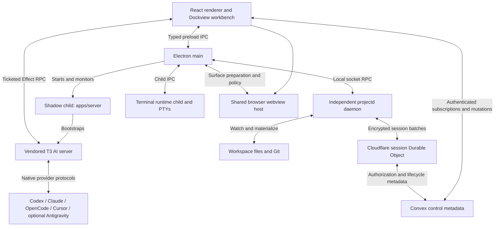

# Project study

Studied on 2026-10-01 at source commit `31798bde5cb1c3b9cd4ae4a8681bc3b3a0cbb4d4`, branch `feat/i18n-collab-browser-chat`. This is an implementation-based orientation to the main paths, not a complete audit or a runtime qualification report.

Cozea is a desktop development workbench that combines local projects, provider-native AI conversations, terminals, browser previews, live collaboration, and organization DevApps. Its defining architectural choice is separating the lifetime of a visible tile from the runtime or durable data behind it.

For the migrated project/workspace model, local/cloud boundary and offline limitations, see [New project system study](project-system-study.md).

## Identity and ownership

| Identity | What it names | Owner |
| --- | --- | --- |
| Device principal | One installation, public `czd_…` identity, private signing/encryption keys | Electron secure storage; authenticated principal record in Convex |
| Project | Shared project metadata, memberships, tasks, publication associations | Convex |
| Workspace | An exact device-local checkout or attached folder, including storage ownership | Local workspace catalog and projectd registry |
| Workbench / lane / tile | How capabilities are arranged and which local execution context they use | Renderer models, desktop persistence, runtime session manager |
| Collaboration session | Explicit shared-session membership, session workspace and encrypted replica | Convex control metadata, projectd, Cloudflare session room |
| AI thread | Provider instance, conversation, model/modes, transcript and execution context | T3 runtime; device-local draft/history supplements |

A project ID is not a filesystem path. A branch name is not collaboration membership. A tile ID is not a conversation or process identity. These distinctions matter when reopening history, switching projects, detaching previews, importing folders, and deleting projects.

## Process map

Electron also owns the device/hosted DevApp adapters and native automation helpers. The terminal child, projectd daemon, and T3 server have distinct shutdown and persistence rules; keeping a workbench alive does not imply that every process survives application Quit.

## Main workflows

**Startup.** `electron/mainEntry.ts` installs monitoring, lifecycle/bootstrap handling, main services and quit cleanup. `electron/main.ts` creates the isolated, sandboxed renderer and schedules workspace catalog, projectd and shadow-runtime startup. Renderer `src/main.tsx` restores bootstrap state and durable workbench models before interactive routes can create replacement state. `App.tsx` composes authentication, onboarding, routing and application-wide runtime hosts. `AppAgentRuntimeHost` owns the T3 connection independently of individual chat tiles and gates the scheduled-task runner on runtime readiness.

**Authentication.** Electron holds separate ECDSA signing and ECDH encryption keys. Cloudflare challenge/complete routes issue short-lived ES256 tokens after proof of key possession. Convex validates the issuer and resolves the device through `ctx.auth`, checking key version and revocation boundaries. Cached presentation can paint the shell while cloud authority is revalidated. Display names and avatars describe the device; they do not replace its cryptographic identity. See the authorization finding below for an endpoint-level gap in the current implementation.

**Create or import a project.** Fresh creation currently creates the Convex project first, asks Electron to create/register a managed folder and initialize Git, optionally scaffolds a DevApp or creates a GitHub repository, activates the project, then opens its workbench. Import inspects the manifest and canonical folder/Git state, reuses an accessible existing binding when available, otherwise creates an idempotent provisioning project and attaches the exact folder before activation. Import failure can compensate the newly created project. Attached folders do not become app-owned deletion targets.

**Send an AI message.** `WorkbenchAssistantChatTile` adapts the assistant feature to Dockview. Its controller validates the original execution context/provider instance and flushes the saved draft. On the first send it resolves or creates a T3 project, optionally creates a private thread worktree, and creates the runtime thread. It then uploads attachments and dispatches `thread.turn.start` with model selection, runtime/interaction modes, and selected skills. Shell events and per-thread detail subscriptions project runtime state into chat UI. Private-worktree changes have an explicit Apply to Session path. Approvals follow provider capabilities and the selected runtime mode; the contracts support both `approval-required` and `full-access`, with `full-access` as the declared default. The old claim that every AI edit waits for a renderer diff-write approval is therefore not a safe universal model.

**Collaborate.** projectd watches a dedicated session workspace, ingests disk changes into a Yjs tree/text replica plus binary revision metadata, journals outgoing batches, and encrypts them with the session key. A Cloudflare Durable Object assigns ordered session sequences, deduplicates batches, persists ciphertext and supports replay/snapshots. Peers decrypt, merge, and materialize the replica to disk. Binary bytes use the encrypted object-store path. The daemon owns reconciliation independently of React and particular tile types, so changes from agents or external tools enter the same filesystem path. AutoGit uses a room-owned leader lease and replica barriers to create/push coherent checkpoints. Other members adopt the saved Git baseline while preserving working-tree changes.

**Use terminals and previews.** Electron's `TerminalService` delegates PTYs to the separate workbench runtime child; renderer terminal views attach to those terminals. The current `DevServerService` shares one managed run per workspace, including its auxiliary processes, and joins concurrent ensure requests. Lane IDs remain bookkeeping metadata. Closing a preview surface can leave its process headless and available for reattachment. Browser, Dev Server and DevApp guests render through one renderer-wide webview host. Agent automation addresses those living guests by opaque runtime tab IDs, with user interaction able to interrupt an agent's control lease.

**Navigate.** A persistent project shell hosts ordinary routes and retained workbench surfaces. Up to five eligible ordinary pages keep React state and route snapshots; up to three workbench sessions are retained with their original project/workspace contexts. Ordinary hidden pages use hidden React Activity, whereas parked workbenches keep widget effects alive and use CSS/inert hiding. This avoids re-creating Dockview and terminals merely because a different page is visible. Visibility, runtime lifecycle and durable persistence remain separate concerns.

**Publish a DevApp.** Development packages are local, trusted code with expiring worker capability approval. Publishing produces an immutable static artifact or a signed executable release for an organization. Install/update/uninstall is explicit and device-local installations pin exact versions. Static content uses a protected custom origin; published workers/services require the declared device or hosted container adapter. Device execution uses Apple Containerization; hosted execution uses Cloudflare Sandbox. Missing containment does not fall back to an ordinary process. Installed artifacts are prepared locally before online resolution; hosted execution still needs its hosted adapter/network. Folder grants and agent invocation are separate, exact-release authorization decisions.

## Where durable state lives

| State | Backing |
| --- | --- |
| Device, group, project and session authority; tasks; publication/release metadata | Convex |
| Collaboration ciphertext log, replay state, leader leases, barriers and snapshots | Cloudflare session Durable Object storage |
| Encrypted collaboration binary objects | Cloudflare R2 |
| Workspace registry, workbench records, materialization state, encrypted session recovery/outbox | projectd SQLite |
| Desktop workbench model/layout, query cache, last route and runtime session registry | Electron persistence worker, atomic versioned JSON records under `userData/desktop-state-v2` |
| Native conversation/runtime state | T3 runtime storage; bootstrap proxy points to `userdata/state.sqlite` |
| Unsent composer text/images and content revisions | Device-local IndexedDB assistant draft repository |
| Project-to-thread history associations | Device-local localStorage association index |
| Managed skill library and provider bindings | Local skill folders with ownership markers |
| Project Memory graph | Agent-authored `graphify-out/graph.json` |

Local source directories, drafts, and installed artifacts have different retention rules. Tile closure and project archival must not be treated as deletion. Explicit project deletion coordinates local runtime cleanup with the bounded cloud cascade, while attached source folders remain on disk.

## Code entry points

| Work | Start reading |
| --- | --- |
| App startup and route composition | `apps/desktop/electron/mainEntry.ts`, `apps/desktop/electron/main.ts`, `apps/desktop/src/main.tsx`, `apps/desktop/src/App.tsx`, `apps/desktop/src/router/routes.tsx` |
| Project creation / folder import | `apps/desktop/src/features/projects/ui/CreateProjectDialog.tsx`, `apps/desktop/src/features/projects/hooks/useLocalProjectImport.ts`, `apps/desktop/electron/workspaces/WorkspaceCatalog.ts` |
| Workbench composition / lifetime | `apps/desktop/src/features/projects/layouts/ProjectLayout.tsx`, `apps/desktop/src/features/workbench/WorkbenchKeepAliveHost.tsx`, `apps/desktop/src/features/workbench/WorkbenchActivity.tsx`, `apps/desktop/electron/services/WorkbenchSessionManager.ts` |
| AI sends / runtime connection | `apps/desktop/src/features/workbench/assistant/useWorkbenchAssistantTileController.tsx`, `apps/desktop/src/substrate/AppAgentRuntimeHost.tsx`, `apps/desktop/src/substrate/useT3Cutover.ts`, `apps/server/src/bootstrap.ts`, `apps/server/src/t3Bootstrap.ts` |
| Collaboration / AutoGit | `apps/projectd/src/server/ProjectdServer.ts`, `apps/projectd/src/collaboration/CollaborationSessionHost.ts`, `apps/projectd/src/collaboration/SessionReplica.ts`, `apps/projectd/src/collaboration/SessionTransport.ts`, `apps/projectd/src/autogit/AutoGitAgent.ts`, `cloudflare/worker/src/durableObjects/CollaborationSessionRoom.ts` |
| Terminal / Dev Server / browser | `apps/desktop/electron/services/TerminalService.ts`, `apps/desktop/electron/workbench-runtime/child.ts`, `apps/desktop/electron/services/DevServerService.ts`, `apps/desktop/src/features/browser/ElectronBrowserHost.tsx`, `apps/desktop/src/features/browser/HostedBrowserWebview.tsx`, `apps/desktop/src/substrate/t3PreviewAutomationHost.ts` |
| Persistence / auth / contracts | `apps/desktop/src/app/model/persistence/desktopPersistenceClient.ts`, `apps/desktop/electron/services/DesktopStatePersistenceService.ts`, `convex/lib/deviceAuth.ts`, `convex/lib/authenticatedFunctions.ts`, `shared/`, `packages/contracts/`, `packages/client-runtime/` |

The renderer dependency direction is app composition → product features → shared UI/utilities/platform clients. Project and workspace ambient contexts, shared stores, and tile shapes belong on neutral ground rather than forcing hosted features to import their workbench host. Architecture tests ratchet cross-feature cycles and remaining Git execution exceptions; projectd's GitService is the canonical product Git owner, but the test pins several remaining desktop Git engines, so consolidation is not complete.

## Verified differences from older instructions

- The root Fastify `server/` directory is absent. `apps/server` boots the local shadow/T3 stack; the Cloudflare worker owns the active gateway routes inspected here.
- Legacy renderer Yjs collaboration, main sync-journal code, and Convex `yjsUpdates`/`yjsDocuments`/`yjsAwareness` tables are retired. `convex/yjs.ts` retains a device key-request round-trip, not the collaboration update log.
- The current tile contract has no source-editor tile; an architecture guard explicitly forbids introducing one as a collaboration requirement.
- `DevServerService.buildRunKey` keys runs by workspace, despite the older workspace/lane description in AGENTS and preview documentation.
- Project creation lives under `features/projects/ui`, not the older `features/projects/components` path, and fresh creation's cloud record currently precedes folder creation.
- The memory graph is structurally valid (19,136 nodes, 48,962 links, no dangling edges) but stamped at `1cb0a4df`, with 138 committed paths changed before the studied HEAD. It guided discovery; source files were the authority. The graph was not rebuilt or restamped by this study.

## Authorization finding requiring follow-up

Static inspection found that `convex/lib/authenticatedFunctions.ts` checks a set of caller identity fields and patterns that omit `principalId`. `projects.listForCurrentUser`, `listSummariesForCurrentUser`, and `getAccessibleBySlug` accept that field and use it for membership lookup. These calls have no `projectId` argument, so the wrapper's separate project guard also does not run. `projects.create` similarly uses the supplied principal for ownership.

This implies a potential cross-principal authorization gap for an authenticated caller who knows another internal principal ID. This is a source-based finding, not a production exploit test. A focused mismatch test and caller-derived principal repair should precede treating those endpoints as verified device-authority boundaries. No authentication code or remote data was changed during the study.

## Verification and operating constraints

This pass inspected source, documentation, package scripts, architecture-test definitions and CI wiring. It did not execute tests, launch the app, deploy services, or assert that older recorded failures still exist. Only this reference and workspace continuity were updated; existing vendored working-tree changes were preserved.

Use Bun for the workspace. Standard checks are `bun run typecheck`, `bun run typecheck:electron`, `bun run typecheck:projectd`, `bun run typecheck:cloudflare`, `bun run typecheck:tests`, `bun run lint`, applicable Vitest suites and `bun run build`. Provider changes also need `check:provider-compatibility` and `test:provider-compatibility`; DevApp contract changes need `devapp:generate` and `devapp:check`. `Dockerfile.agent-checks` is the existing container entry point. Native Electron/macOS acceptance requires the relevant host/runtime environment. Production Convex changes use `bunx convex deploy`; never switch this app with `convex dev`. Release publishing is driven by version tags and the distribution repository, not ordinary branch pushes.
