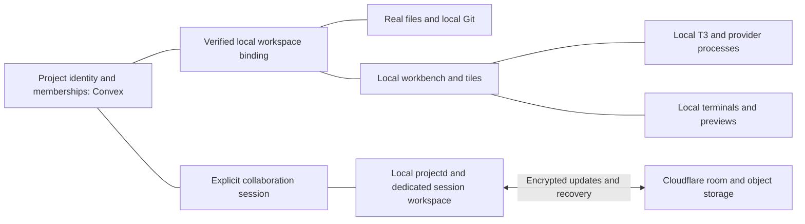

# New project system study

Studied on 2026-10-01 at source commit `31798bde5cb1c3b9cd4ae4a8681bc3b3a0cbb4d4`. The requested product direction is to keep work local and use the cloud sparingly where shared services need it. This document describes the implementation and source-based limitations; it is not a runtime or cost qualification report.

The current boundary is **device-authoritative folders and execution, with cloud-authoritative project identity and sharing**. The migration substantially changes workspace ownership and collaboration, but it does not yet make the complete project lifecycle independent of Cozea's cloud.

The follow-up [local project management examination](project-management-examination.md) traces offline discovery, the unused local project cache, duplicated presence publishers, retained cloud queries and interrupted management operations. The subsequent [completion plan](project-system-completion-plan.md) turns these findings into phased implementation and acceptance criteria.

## The model

| Entity | Meaning | Authority |
| --- | --- | --- |
| Project | Stable project identity, name, repository descriptor, lifecycle, device memberships and optional organization | Convex |
| Workspace | A specific folder/checkout on this device, its verified binding and managed/attached ownership | Electron's local SQLite catalog; projectd has a separate local registry |
| Workbench | Persistent local execution/presentation context for a project and workspace | Device-local records and layout models |
| Lane | Local branch/worktree execution scope | Local workspace/runtime state |
| Collaboration session | Explicit shared membership, session lifecycle, encryption and coordination | Convex metadata, local projectd replica, Cloudflare session room |
| Assistant project/thread | T3's native conversation context, bound to the execution folder | Local T3 runtime and provider-native state |

A project can have multiple local workspaces/workbenches. Each participant has their own session workspace and presentation. Absolute paths and tile arrangements are not shared project authority. A branch belongs to a session; matching a branch name does not enroll a folder in collaboration. T3's assistant project ID is separate from the Cozea project ID.

## What the migration changes

1. **Folder identity is explicit.** `WorkspaceCatalog` persists project-to-folder bindings in `userData/local-workspaces.sqlite`. Resolution checks a recorded folder, ownership, markers and repository identity. A slug is a recovery/discovery hint, not authority for constructing the current filesystem path.
2. **Existing folders stay in place.** Open Existing attaches the canonical selected directory rather than copying it into a managed projects directory. Reopening the same canonical path reuses its binding when the device can access the associated project.
3. **Storage ownership is recorded.** Created/cloned workspaces are managed; imported folders are attached. Being inside a managed projects directory does not make an attached folder disposable. Trash eligibility requires catalog proof, a managed root and matching marker, followed by a canonical containment check.
4. **Sharing has its own workspace and lifetime.** projectd provisions a dedicated session repository, can clone from the source's local Git repository, and can optionally copy dirty working-tree changes. The source workspace remains separate. Local activation switches presentation without ending the shared session.
5. **Collaboration moved out of the renderer.** projectd observes and materializes disk changes, journals encrypted outgoing batches and recovers independently of React. The obsolete renderer Yjs engine, Electron sync journal and Convex Yjs update/document/awareness tables were removed. An editor tile is not required for synchronization.

The historical JSON path registry migrates once into the local catalog. Existing ownership rows are classified conservatively: unknown provenance becomes attached, and managed claims are downgraded if a containing managed root cannot be proven. projectd separately imports the catalog into its SQLite registry once. Dedicated session provisioning registers its identity in both local systems. These are separate stores with separate responsibilities, not one unified database.

## Local and cloud responsibilities

| Experience | Local part | Cloud part / dependency |
| --- | --- | --- |
| Open a bound workspace | Resolve recorded workspace, verify filesystem, restore workbench | Stable-ID routes can resolve locally before Convex returns; metadata/access revalidation remains cloud-backed |
| Create a project | Create folder, initialize Git, register workspace | UI creates a Convex project first and activates it afterward |
| Open/import a folder | Inspect manifest, canonical path and Git; attach exact directory | Existing binding is checked against Convex access; an unbound folder gets a Convex project |
| Project list/name/archive/delete | Local row preferences, close/forget binding, runtime cleanup | Sidebar list, rename, archive, restore and project deletion use Convex |
| AI conversations | T3 server/provider processes, thread storage, drafts and history bindings | Provider inference/auth may need the provider's network service; local orchestration does not imply local inference |
| Terminals/dev servers/browser preview | Local processes, PTYs, guests and persisted arrangement | These execution services do not need Convex to perform their basic local work |
| Live collaboration | Dedicated folder, CRDT replica, durable encrypted outbox, binary cache, local reconciliation | Convex access/session metadata; Cloudflare ordered encrypted relay/log, snapshots and R2 binary objects |
| Git | Local GitService operations and repository state | Remote clone/push/fetch/PR operations need the Git host |
| Organization DevApps | Local development; installed immutable artifacts and explicit version selection | Organization catalog/publication/distribution; hosted execution needs its hosted adapter |

The `syncStatus: "local_only"` field does not mean a cloud-free project. `projects.create` inserts the project in Convex with that value. It must not be used as evidence that project creation works offline.

## Lifecycle paths

**Fresh project:** `CreateProjectDialog` requires a ready principal, creates the Convex record, asks Electron to create a managed workspace and initialize Git, optionally scaffolds a DevApp or creates a GitHub repository, then marks the project active and navigates to the local workbench. This path currently does not use the provisioning token/compensation pattern used by folder import; failure after the cloud create can leave a partial project or folder.

**Existing folder:** `useLocalProjectImport` inspects the root DevApp manifest and preflights the directory. If a binding exists, an authenticated cloud lookup either permits reuse or explicitly returns inaccessible. Only that inaccessible result triggers local projection cleanup while preserving files; a thrown network/auth failure goes to the error path. For an unbound folder, the hook creates an idempotent provisioning project, attaches the exact folder as attached, activates the project and opens it. Attachment failure attempts to compensate a newly created cloud record. Final activation failure occurs after attachment and is reported; these local and cloud steps are not one atomic transaction.

**Reopen/repair:** `ProjectLayout` can resolve the stable route project ID through local IPC while cloud metadata loads. Resolution returns ready, missing binding or broken binding with repair actions. Recent successful verification is cached; catalog pushes and filesystem checks refresh local consumers. Locate/attach is a local operation; cloning additionally needs repository access. Missing/disconnected folders surface repair rather than silently choosing a newly derived slug path.

**Close/archive/delete:** closing a workspace removes its local binding and presentation without deleting the cloud project. Archival updates cloud lifecycle and preserves local files/state. The sidebar's project deletion waits for the cloud mutation before local cleanup. Cleanup stops dev servers and workbench runtime sessions, deletes associated assistant state/drafts, forgets workspace bindings and optionally trashes only verified managed folders. Attached folders remain. Convex marks the project deleted and schedules bounded cleanup of project-owned rows/blobs before removing the document. Source deletion is a separate local ownership decision.

**Share/resume:** explicit session creation/join provisions a dedicated managed repository and local Session Workbench. Membership and tickets come from verified cloud/device authority. projectd owns the background session rather than a renderer tile. Closing/hiding its presentation does not equal Leave, Pause or Close Session. AutoGit checkpoints a coordinated replica frontier and publishes through the remote; cloud relay and Git publication have distinct roles.

## Offline behavior and remaining cloud dependence

Implemented offline/reconnect support is meaningful, but bounded:

- A returning initialized device can paint cached presentation while cloud authentication is revalidated. The principal/token are deliberately cleared until proof of possession succeeds; cached presentation does not grant cloud authority.
- Stable project-ID routes and known local bindings can restore local workbench presentation independently of a fresh project query. Legacy slug routes and cloud-dependent features do not have the same guarantee.
- The sidebar constructs project items directly from `listSummariesForCurrentUser`; it does not construct an offline list from the local workspace snapshot. With no ready principal it skips the query and has no project items. A returning workbench and the project picker therefore have different offline behavior.
- Opening the same folder through import still performs an online access query. Creating/importing a project requires cloud mutations. Rename/archive/restore/delete similarly require Convex. There is no local-first project command queue in these inspected paths.
- Cached project metadata is a bounded query cache, with a default five-minute read age and a twenty-four-hour retention cap. It is not a durable local project metadata authority. Some sync/runtime context is also gated on the cloud project and principal; local workbench session presentation is a separate path.
- A previously joined session can recover offline using retained identity, keys, ticket, replica and filesystem baseline. The host refuses offline observation without a consistent retained index/baseline. Unacknowledged encrypted batches remain in SQLite and replay later. First join and access/lifecycle transitions require cloud authority; an explicit denial is handled differently from temporary network failure.

These observations support calling the implementation local-first for execution and recovery. They do not establish that every project operation works without Cozea's cloud or that an uninitialized installation can start fully offline.

## How sparingly the cloud is used

The strongest reductions are the removal of normal file content updates from Convex, local workspace/layout/conversation ownership, and explicit session-based synchronization. Ordinary source-folder work is not automatically shared merely because it is on the default branch.

Some recurring cloud use remains:

- Project presence is enabled for an authenticated resolved workspace without requiring an active collaboration session. `useProjectPresence` sends a heartbeat every thirty seconds plus activity/navigation transitions. It subscribes to active users as well. This is a concrete place to review whether solo local work needs cloud traffic.
- Project list/detail, publisher status, inbox and session metadata use reactive subscriptions. A subscription is not equivalent to a polling request, but these surfaces remain cloud-dependent.
- A live session stores and relays encrypted edits, including when its presentation is idle and the daemon continues. Batching, ordered replay, snapshot compaction and bounded streaming avoid some unnecessary work; this remains a durable cloud data service, not only a connection broker.
- Scope policy excludes `.git`, transient editor files and ignored local state by default. Tracked/admitted content is shared; optional environment-file sharing widens the scope. The exact admitted content influences relay/object-storage work.

No production usage counters, billing measurements or before/after load capture were performed. Moving updates from Convex to Cloudflare changes the cloud cost profile; this study cannot quantify savings.

## Boundaries for subsequent work

Review these independently while preserving the new identity/ownership model:

1. **Local project management:** whether create/import/list/rename/close should be fully usable locally, and which project metadata truly needs shared authority.
2. **Workspace lifecycle:** binding, duplicate detection, repair, movement, attached-folder protection and interrupted create/import recovery.
3. **Runtime/presentation lifecycle:** what survives navigation, tile closure, app Quit and daemon restart; keep assistant, terminal, dev server and collaboration identities distinct.
4. **Optional shared services:** device/org access, explicit session enrollment, invitations, relay/recovery, Git publication and organization distribution.
5. **Cloud work during solo use:** presence/subscription policy and measurement before further changes.

The collaboration completion roadmap records signed-package/two-physical-Mac acceptance as still pending. Its section-level historical status table and older path/runtime plans contain superseded claims. Current source and the recorded final acceptance gate should be distinguished from historical phase checkmarks.

## Evidence and verification

Primary source paths:

- Model/contracts: `shared/workspaceTypes.ts`, `shared/collaboration/types.ts`.
- Local authority: `apps/desktop/electron/workspaces/WorkspaceCatalog.ts`, `WorkspaceCatalogRuntime.ts`, `legacyMigration.ts`, `Migrations/003_WorkspaceStorageOwnership.ts`, `apps/desktop/electron/ipc/registerWorkspaceHandlers.ts`.
- Local daemon records: `apps/projectd/src/workspaces/WorkspaceCatalogImporter.ts`, `WorkspaceRegistry.ts`, `apps/projectd/src/workbenches/WorkbenchManager.ts`.
- Project lifecycle/UI: `apps/desktop/src/features/projects/ui/CreateProjectDialog.tsx`, `hooks/useLocalProjectImport.ts`, `layouts/ProjectLayout.tsx`, `ui/ProjectSidebar.tsx`, `lib/projectLocalCleanup.ts`, `convex/projects.ts`, `convex/schema.ts`.
- Offline/presence: `apps/desktop/src/contexts/AuthContext.tsx`, `app/model/queryCache.ts`, `hooks/useProjectPresence.ts`, `contexts/project/ProjectSyncContext.tsx`, `contexts/project/useActiveWorkbenchScope.ts`.
- Session data path: `apps/projectd/src/collaboration/CollaborationSessionHost.ts`, `OutboundBatchQueue.ts`, `SessionTransport.ts`, `apps/projectd/src/server/ProjectdServer.ts`, `apps/projectd/src/filesystem/ScopePolicy.ts`, `cloudflare/worker/src/durableObjects/CollaborationSessionRoom.ts`.

Existing tests inspected cover exact-path/no-copy attachment, ownership-safe Trash, marker relocation, concurrent/default lane resolution, stale binding recovery, durable local workbench switching, offline/background session restoration, encrypted outbox recovery and legacy architecture removal. Test definitions were read; the tests were not executed in this study.

Intent/history references read in full: `docs/local-runtime-and-project-path-plan.md`, `docs/attached-local-projects-plan.md`, `docs/desktop-product.md`, `docs/collaboration/collaboration-completion-roadmap.md`. The broad `docs/current/project-study.md` provides the rest of the app map. No application source, schema, auth, Electron handlers, production state or deployment was changed.
